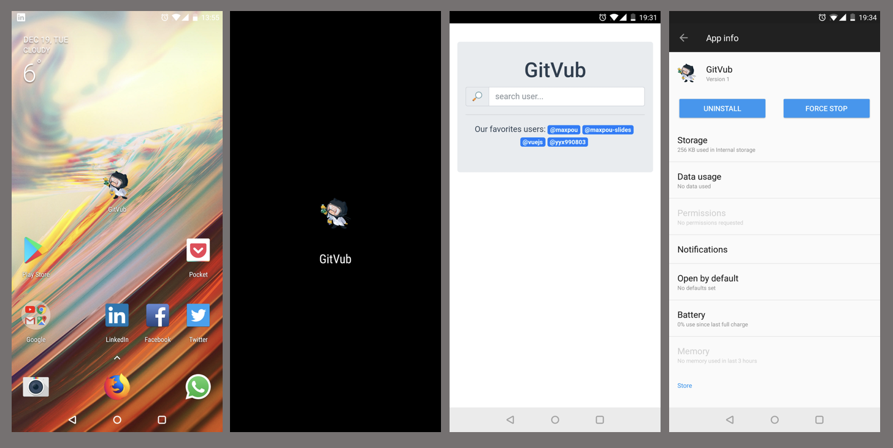

# GitVub

[](https://travis-ci.org/maxpou/gitvub) [](https://standardjs.com) [](https://github.com/facebook/jest)

> GitHub + Vue.js = GitVub

A Vue.js **Progressive Web App (PWA)** based on GitHub API.



*icon on desktop, splash screen and screen shot taken from this application*

## What's inside?

* [VueJs 2](https://vuejs.org/): an awesome JS Framework
* [Vuex](https://vuex.vuejs.org/en/): A state management library for VueJs
* [vue-router 2](https://router.vuejs.org/en/): a routing library
* [Axios](https://github.com/mzabriskie/axios): a well known library for XMLHttpRequests
* [Facebook/Jest](https://facebook.github.io/jest/): a test library
* [Material Design Lite](https://getmdl.io/): CSS Framework
* [Material Icons](https://material.io/icons/): a set of icons

... using the [GitHub Api](https://api.github.com/) ([doc](https://developer.github.com/v3)).

Based on [vue/webpack template](https://github.com/vuejs-templates/webpack) and follow [his file structure](http://vuejs-templates.github.io/webpack/structure.html).


## Notes

* Code style follow:
  * [StandarJS](https://standardjs.com/)
  * [VueJS **reccomended** rules](https://vuejs.org/v2/style-guide/) (thanks to [eslint-plugin-vue](https://github.com/vuejs/eslint-plugin-vue#readme))
* API test use [dynamic import (Stage 3)](https://github.com/tc39/proposal-dynamic-import)
* API calls are cached in sessionStorage

## Working with HTTPS

```bash
# first install ngrok (https://ngrok.com/)
$ npm install -g ngrok

# Terminal 1: (will run app on port 8080)
$ npm run dev

# Then on a 2nd terminal:
$ ngrok http 8080

ngrok by @inconshreveable                                                                                                                                                                                                   (Ctrl+C to quit)

Session Status                online
Version                       2.2.8
Region                        United States (us)
Web Interface                 http://127.0.0.1:4040
Forwarding                    http://ada5c26b.ngrok.io -> localhost:8080
Forwarding                    https://ada5c26b.ngrok.io -> localhost:8080

Connections                   ttl     opn     rt1     rt5     p50     p90
                              0       0       0.00    0.00    0.00    0.00
```

You can now work with the HTTPS url given (in the example above: `https://ada5c26b.ngrok.io`)

## Commands

``` bash
# install dependencies
npm install

# serve with hot reload at localhost:8080
npm run dev

# serve a production build
npm install -g serve
npm run build && serve dist/

# build for production with minification
npm run build

# build for production and view the bundle analyzer report
npm run build --report

# Run tests
npm test

# Run tests + generate coverage (available under /tests/unit/coverage)
npm test -- --coverage

# Run tests in watch node
npm test -- --watchAll

# Run tests + update snapshots if needed
npm test -- -u
```

For a detailed explanation on how things work, check out the [guide](http://vuejs-templates.github.io/webpack/) and [docs for vue-loader](http://vuejs.github.io/vue-loader).
